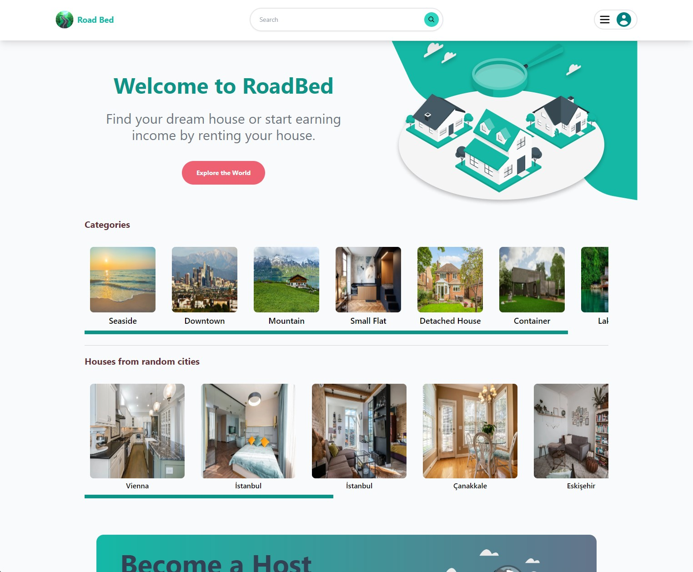
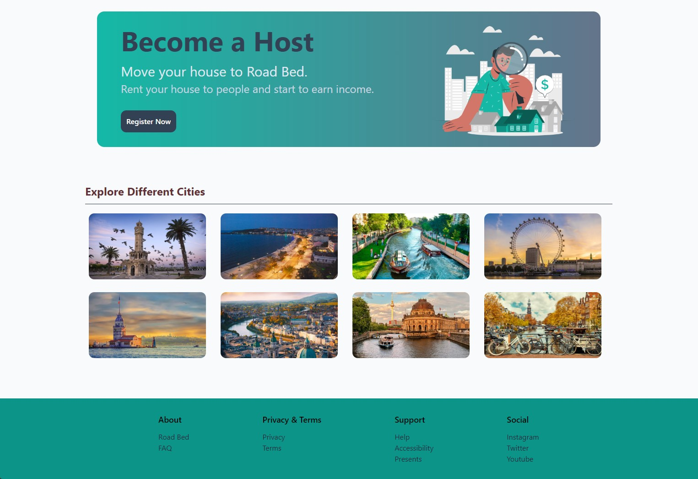
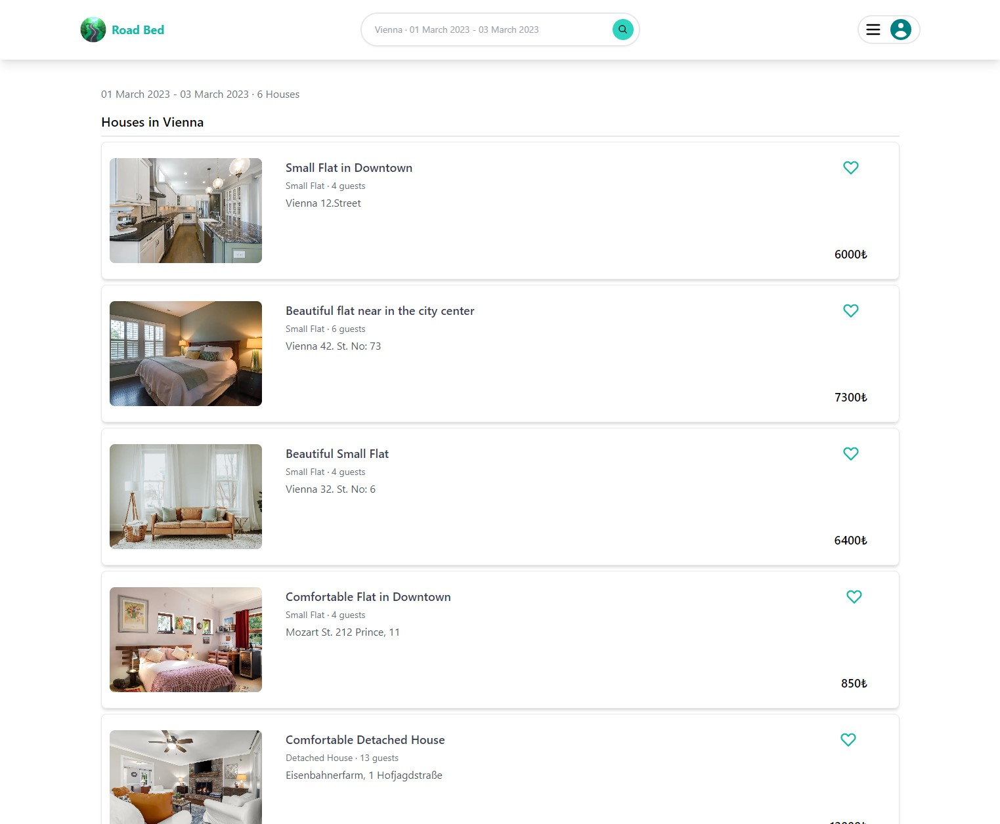
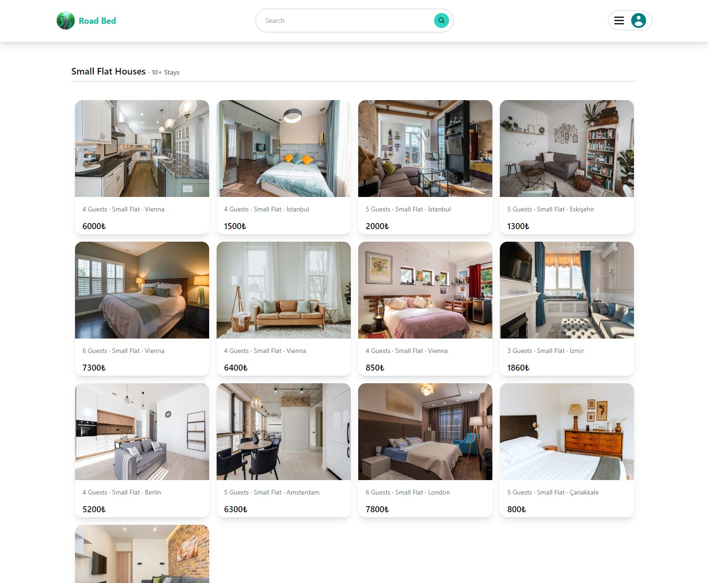
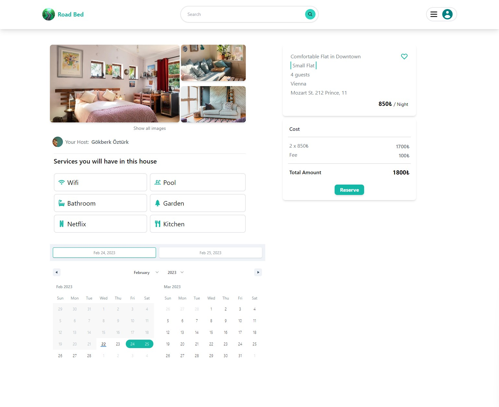
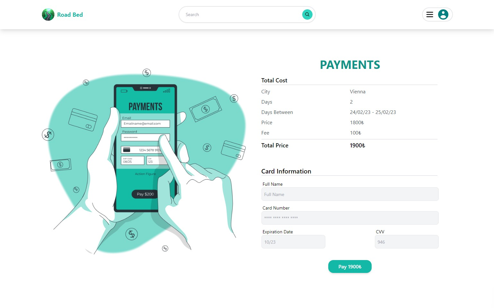
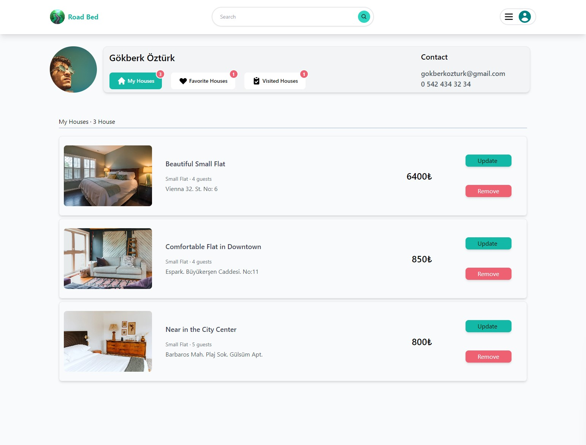
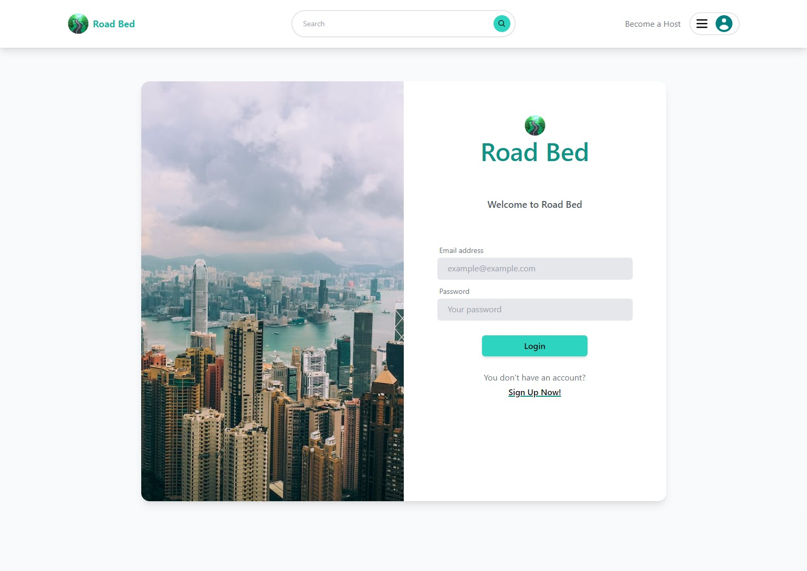

# Road Bed Full Stack Project
Road Bed project is a full stack web application project and it was created with Java Spring Boot and Next.js.
Also, frontend design of project was designed with Tailwind CSS.

## Brief Description of the Project
Road Bed is a project where people can rent a house on a daily basis. Also, people can start earning income
by renting out their homes and they can search for homes in a specific city and between specific dates.
User who wants to rent a house or add a house to his favourites, needs to create an account.
People can view the details of houses. For example, images of house, price, empty dates of house for reservation,
their landlord name and services in the house.
People can also filter houses using category names or cities where the houses are located. 
In the house detail page, user can easily select the dates to reserve the house. Then, In payment page,
they can pay the total price with their credit card information.
Users who have an account can view their favourite houses, visited houses and their own houses in the profile page.
They can add a profile picture for their account if they wish. To earn income with renting their houses,
people can add their houses on the Create page. In this page, users can add their house images and other
house details. 

## Technologies
<h4>Backend</h4>
<ul>
    <li>Java 17</li>
    <li>Spring Boot 3</li>
    <li>Spring Security</li>
    <li>Spring Data MongoDB</li>
    <li>MongoDB</li>
    <li>Redis</li>
    <li>Docker</li>
    <li>Jwt</li>
    <li>Cloudinary</li>
    <li>AOP</li>
    <li>Mockito </li>
</ul>

<h4>Frontend</h4>
<ul>
    <li>JavaScript</li>
    <li>Next.js</li>
    <li>Next Auth</li>
    <li>Redux</li>
    <li>Tailwind CSS</li>
    <li>Axios and Interceptors</li>
    <li>React Date Range</li>
    <li>React Hook Form</li>
    <li>React Hot Toast</li>
</ul>

## Usage Of Technologies
<h4>On the Backend Side, </h4>
Java Spring Boot was used for generating Rest Api. MongoDB was used as NoSql database.
In this project, I used N-Layered architecture. In data access layer, Spring Data MongoDB was used to access data
from database. Authorization and authentication processes was provided by Spring Security and Jwt.
When user login, access token and refresh token is generated. I used Redis for 2 purposes in this project: 
Storing Refresh Token and Caching. For first purpose, I store refresh token in Redis when user logs in.
If the access token is expired, I use the refresh token stored in Redis to refresh this access token. 
As a second goal, Houses, categories and cities are cached using Redis. Redis configuration is in 
config package.Also, AOP was used. For logging process, Logging aspect was created and saving, deleting methods were logged. 
To upload images on the cloud, Cloudinary Api was used. Cloudinary configuration and ImageServices are in config package.
Unit tests of the business layer is written using Mockito. Unit tests are inside the src/test package.
Docker was used to execute Redis and MongoDB images. For this purpose, docker compose file was generated.

<h4>On the Frontend Side, </h4>
Frontend side was written using JavaScript and Next.js. Server side rendering process is used.
To store the logged in user's session, Next Auth was used. After logged in, Next Auth session was used
to store access token and refresh token. Thus, I access jwt token from anywhere in my components. 
As a global state, Redux was preferred. Reservation details are kept in Redux.
For sending post request to backend api, Axios was preferred. Axios Interceptor was used to add access token 
to the request header. Also, if access token is expired when response is returned, refresh token request
is automatically sent to refresh access token. 
React Date Range was used to select date range for searching and reserving house. For form generating and validation,
React Hook Form was preferred. React Hot Toast was used to notifications.
Tailwind CSS was used for UI and Responsive design of the project.

## How can I use this project? 

 1. Clone or Download zip folder of this repository 
 
    
    git clone https://github.com/VonHumbolt/RoadBedProject.git

 2. Create <i> .env </i> file in root folder and paste your cloudinary configuration url. 
    .env file should look like this:

    CLOUDINARY_URL=cloudinary://api-access....

 3. Run docker compose file for redis and mongo images.
    Open cmd in project root folder and type:

    docker compose up -d

 4. Start your backend project with your favourite IDE. 

 5. In src/main/road-bed-frontend directory, open cmd and type: 

    npm install

 6. Start frontend project. 

    npm run dev

## UI of Project
<h4>Main page</h4>

<h4>Searched Houses</h4>

<h4>Filter Houses in the Same Category</h4>

<h4>House Detail Page</h4>

<h4>Payment Page</h4>

<h4>Profile Page</h4>

<h4>Login Page</h4>

